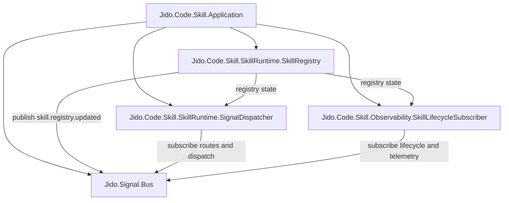
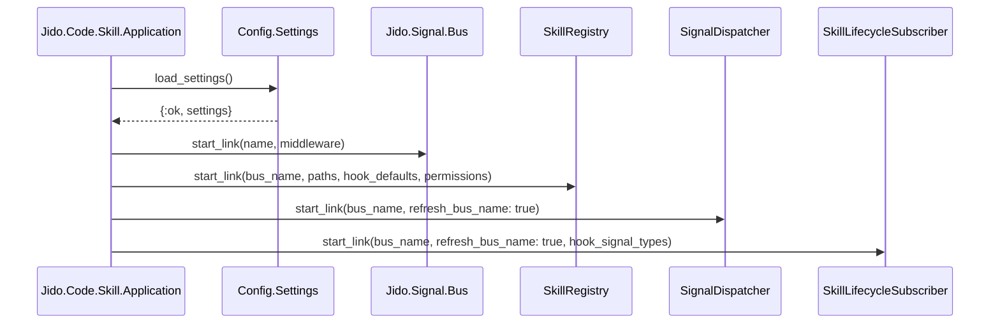

# Architecture Overview

This runtime is a small OTP application that loads settings, compiles/discovers skills, and dispatches signal-driven execution.

## Runtime Boundaries

- Entry point: `Jido.Code.Skill.Application`.
- Configuration and merge rules: `Jido.Code.Skill.Config` and `Jido.Code.Skill.Config.Settings`.
- Skill discovery and cached metadata: `Jido.Code.Skill.SkillRuntime.SkillRegistry`.
- Signal route dispatch and execution: `Jido.Code.Skill.SkillRuntime.SignalDispatcher`.
- Hook emission: `Jido.Code.Skill.SkillRuntime.HookEmitter` (called by compiled skill modules).
- Observability subscriber: `Jido.Code.Skill.Observability.SkillLifecycleSubscriber`.

## Supervision Topology

## Startup Sequence

## Data Inputs

- Global settings: `~/.jido_code/settings.json`
- Local settings: `.jido_code/settings.json`
- Global skills: `~/.jido_code/skills/**/SKILL.md`
- Local skills: `.jido_code/skills/**/SKILL.md`

## Design Constraints (Current)

- Settings merge order is deterministic: defaults -> global -> local.
- Local skill name collisions override global skill entries.
- Only `pre`/`post` hook points are recognized.
- Route and signal subscription paths are normalized to dot form on the bus.
