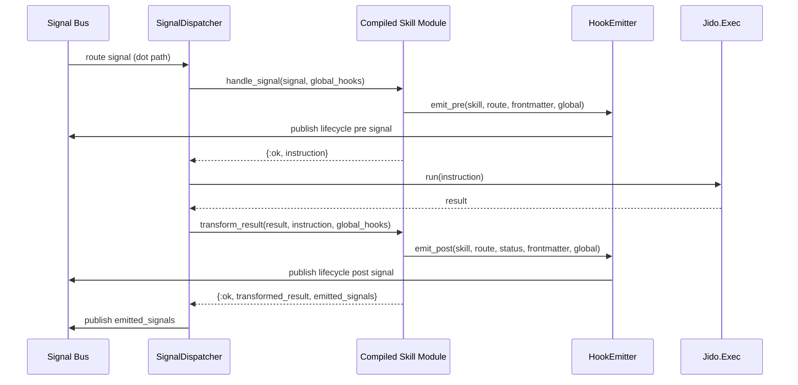

# Signal Lifecycle and Fallbacks

This runtime is signal-first. Dispatch, hooks, registry refreshes, and observability all depend on `Jido.Signal.Bus` subscriptions.

## Signal Types and Normalization

- Route signals: frontmatter route `a/b/c` subscribes as `a.b.c`.
- Lifecycle hooks: configured slash paths (for example `skill/pre`) publish as dot paths (`skill.pre`).
- Permission blocked: always `skill.permission.blocked`.
- Registry update: always `skill.registry.updated`.

## End-to-End Dispatch Lifecycle

Permission branch:

- When skill permissions evaluate to `{:ask, tools}` or `{:denied, tools}`, dispatcher skips execution and emits `skill.permission.blocked`.

## Hook Resolution Rules

Effective hook config is resolved in this order:

1. Skill frontmatter hook (`jido.hooks.pre|post`)
2. Global settings hook defaults (`hooks.pre|post`)

Additional behavior:

- `enabled: false` in frontmatter disables hook emission.
- Partial frontmatter hook config inherits missing fields from global defaults.
- Missing/invalid hook signal types or bus names are logged and safely ignored.

## Refresh and Migration Fallbacks

Both dispatcher and lifecycle subscriber are resilient to runtime refresh failures.

| Component | Operation | Failure Type | Behavior |
|---|---|---|---|
| SignalDispatcher | Startup | `list_skills` unavailable/error | Starts with empty routes and recovers on refresh/update |
| SignalDispatcher | Startup | Route subscription failure | Keeps process alive with empty routes |
| SignalDispatcher | Refresh | Registry read/invalid response | Keeps existing route subscriptions |
| SignalDispatcher | Refresh | Bus migration failure | Keeps cached bus and retries on later refresh |
| SignalDispatcher | Refresh | Hook defaults read failure | Keeps cached hook defaults |
| SkillLifecycleSubscriber | Startup | Registry hook read failure | Starts with base configured subscriptions |
| SkillLifecycleSubscriber | Refresh | Registry read/invalid response | Keeps existing subscriptions |
| SkillLifecycleSubscriber | Refresh | Bus migration failure | Keeps cached bus subscriptions |
| SkillLifecycleSubscriber | Refresh | Hook defaults read failure | Keeps cached hook defaults |

## Telemetry Emission

`SkillLifecycleSubscriber` emits telemetry event:

- Event: `[:jido_skill, :skill, :lifecycle]`
- Measurement: `%{count: 1}`
- Metadata includes: `type`, `source`, `data`, `bus`, `timestamp`, `phase`, `skill_name`, `route`, `status`, `reason`, `tools`
